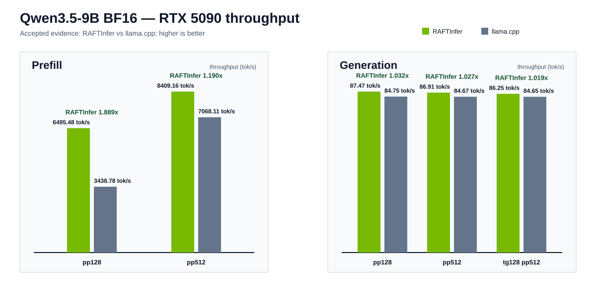

# RAFTInfer

[简体中文](README.zh-CN.md)

Correctness-gated RAFT/RMM inference with custom CUDA kernels for RTX
50-series GPUs.



## Benchmark summary

Accepted Qwen3.5-9B BF16 evidence on an NVIDIA GeForce RTX 5090 compares
RAFTInfer with llama.cpp only. RAFTInfer is higher in all five displayed
measurements: PP128 and PP512 prefill, plus PP128, PP512, and TG128@PP512
generation. The plotted ratios are the exact source ratios rounded to three
decimals. See [benchmark methodology](docs/benchmarks.md) and the committed
[schema-v2 evidence](benchmarks/results/qwen35-9b-bf16-rtx5090.jsonl).
The measured `auto` policy uses split-k-256 for the two long-context arms while
retaining the zero-workspace single-block path for PP128.

The protocol used 5 warmups and 20 measurements per arm, BF16 Qwen3.5-9B
ModelScope revision `460979c3d11864dd16408d860ac930a360a2fac2`, pinned llama.cpp revision
`aedb2a5e9ca3d4064148bbb919e0ddc0c1b70ab3`, and exact greedy parity for 4
prompts × 32 tokens. Results are a single accepted RTX 5090 environment, not a
general hardware or workload claim.

## Scope

- RTX 50-series Blackwell (`sm_120a`) only; other GPU families are unsupported.
- Qwen3.5-9B text generation with BF16 weights and BF16 KV cache in the
  accepted evidence.
- RAFT and RMM form the device-resource and allocation foundation. Project C++
  and CUDA own the high-performance model operators; Rust provides the coarse
  ABI/runtime, tokenizer, CLI, and orchestration layer.
- Reuse of `bw24` material is permitted only through the documented license,
  provenance, correctness, numerical, and RTX 50 performance gate. RAFTInfer
  does not publish a `bw24` performance comparison.

## Architecture

```text
Rust CLI/runtime → coarse C ABI → C++ execution plans → RAFT/RMM → cuBLASLt + custom CUDA kernels
```

The ABI crosses model and session operations such as prefill, decode, reset,
and logits transfer; Rust does not dispatch individual CUDA operators. Details:
[docs/architecture.md](docs/architecture.md).

## Quick start

```bash
cmake -S . -B build/host -G Ninja -DRAFTINFER_ENABLE_CUDA=OFF
cmake --build build/host
cargo run -p raftinfer-cli -- info
scripts/local-check.sh
```

On an RTX 50 host, build with CUDA and use the renamed CLI:

```bash
cargo run -p raftinfer-cli -- generate \
  --model /path/to/Qwen3.5-9B-c202236-bf16.gguf \
  --prompt "Hello" --max-new-tokens 32 --context 4096 \
  --kv-cache-dtype bf16 --kv-cache-layout head-major --output-format json
```

## Parity and performance reproduction

Prepare the pinned BF16 GGUF and run target-GPU gates in order: shared-GPU
preflight, exact greedy parity, benchmark, then the BF16 gate.

```bash
scripts/gpu-preflight.sh
scripts/qwen35-parity.sh
scripts/qwen35-benchmark.sh
scripts/qwen35-bf16-gate.sh build/evidence/qwen35-benchmark.jsonl
```

Set the required model and llama.cpp environment variables from the
[script environment reference](docs/environment.md). The checked-in data is
rendered deterministically with:

```bash
python3 tools/render_benchmark_chart.py \
  benchmarks/results/qwen35-9b-bf16-rtx5090.jsonl \
  docs/assets/qwen35-bf16-rtx5090.svg
```

## Limitations

- The accepted comparison is Qwen3.5-9B BF16 on one RTX 5090 configuration;
  it does not establish results for other models, quantizations, GPUs, batch
  sizes, or serving workloads.
- The comparison reports throughput, not end-to-end service latency, power, or
  cost. Peak memory is RAFTInfer's RMM logical-allocation peak, not whole-GPU
  process memory.
- CUDA correctness, parity, and performance gates require the target GPU and
  are not run by hosted host-only CI.

## Roadmap

Improve Qwen3.5 coverage, target validation automation, and documented
reproducibility while preserving the correctness-before-performance gate.

## Contributing and security

Read [CONTRIBUTING.md](CONTRIBUTING.md) for the review and RTX 50 validation
contract. Report vulnerabilities through [SECURITY.md](SECURITY.md).

## Citation

Use [CITATION.cff](CITATION.cff) when citing RAFTInfer.

## License

RAFTInfer source is licensed under [Apache-2.0](LICENSE).
